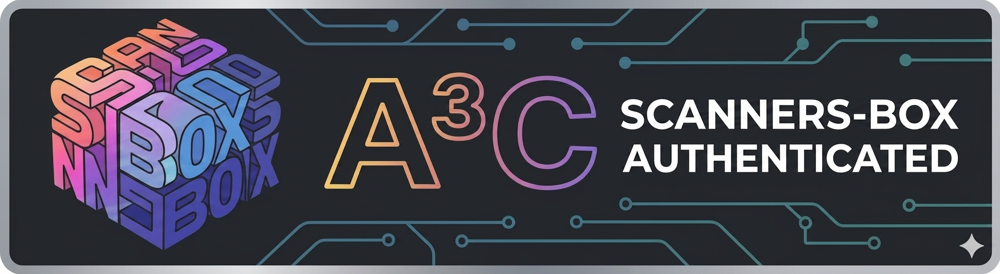

<div align="center">



# A³C — AI Autonomous Cybersecurity Agent

*The Curated Collection of AI-Powered Autonomous Security Agents*

[](https://github.com/We5ter/Project-A3C)
[](LICENSE)
[](https://github.com/We5ter/Project-A3C)

</div>

---

## Overview

> 🚀 **A³C** is a **curated collection** of open-source projects that build **fully autonomous AI cybersecurity agents** — tools that can independently execute penetration testing, vulnerability assessment, threat hunting, and incident response.

A³C serves as the **official index & authentication hub** for AI-driven autonomous security agents. Projects displaying the **A³C badge** are vetted and recommended by [Scanners Box](https://github.com/We5ter/Scanners-Box) as trusted tools in this emerging field.

## Categories

| Category | Description |
|:---------|:------------|
| 🔴 **AI Autonomous Red Team** | AI agents that autonomously plan and execute attack chains |
| 🔵 **AI Autonomous Blue Team** | AI agents for automated defense, detection, and response |
| 🛡️ **AI SOC Agents** | AI-driven Security Operations Center for monitoring, alerting & response |
| 🎧 **AI DevSecOps Assistant** | AI-powered security operations assistant for Q&A, triage & guidance |
| 🔍 **AI Cyber Attacks Attribution** | AI-driven intrusion forensics and threat attribution |
| 💼 **AI Office Network Security** | AI agents for enterprise office network security & DLP |

## 🔴 AI Autonomous Red Team

> AI agents that autonomously plan and execute attack chains — **A³C Authenticated Projects**

| Project | Description | Language | Stars | License |
|:--------|:------------|:---------|:------|:--------|
| [**Cairn**](https://github.com/oritera/Cairn) | A general-purpose state-space search engine, validated first on autonomous penetration testing. It defines no roles or workflows — given a start and end point, it finds paths through unknown state spaces | [](https://github.com/oritera/Cairn) |  |  |
| [**Shannon Lite**](https://github.com/KeygraphHQ/shannon) | An autonomous white-box AI pentester for web applications and APIs. It analyzes source code, identifies attack vectors, and executes real exploits to prove vulnerabilities before they reach production | [](https://github.com/KeygraphHQ/shannon) |  |  |
| [**SickHackShark**](https://github.com/SickHackPark/SickHackShark) | An AI-powered CTF (Capture The Flag) cybersecurity competition automation platform. Uses multi-agent architecture to automate web security testing: recon, scanning, exploitation & flag capture | [](https://github.com/SickHackPark/SickHackShark) |  |  |

<details>
<summary>📖 Project Details</summary>

### Cairn
- **Type**: State-space search engine for autonomous pentesting
- **Approach**: Role-agnostic, workflow-free pathfinding in unknown state spaces
- **Use Case**: Autonomous penetration testing, vulnerability chain discovery

### Shannon Lite
- **Type**: White-box autonomous AI pentester
- **Approach**: Source code analysis → attack vector identification → real exploit execution
- **Use Case**: Pre-production vulnerability proof for web apps & APIs

### SickHackShark
- **Type**: Multi-agent CTF automation platform
- **Approach**: Multi-agent orchestration for full security testing lifecycle
- **Use Case**: CTF competitions, automated web security assessment

</details>

---

## 🔵 AI Autonomous Blue Team

> Coming soon — AI agents for automated defense, detection, and response

_🚧 This category is under curation. [Submit a project](https://github.com/We5ter/Project-A3C/issues/new?title=A%C2%B3C%20Submission:%20[Your%20Project%20Name])!_

---

## 🛡️ AI SOC Agents

> Coming soon — AI-driven Security Operations Center agents

_🚧 This category is under curation. [Submit a project](https://github.com/We5ter/Project-A3C/issues/new?title=A%C2%B3C%20Submission:%20[Your%20Project%20Name])!_

---

## 🎧 AI DevSecOps Assistant

> Coming soon — AI-powered security operations assistants

_🚧 This category is under curation. [Submit a project](https://github.com/We5ter/Project-A3C/issues/new?title=A%C2%B3C%20Submission:%20[Your%20Project%20Name])!_

---

## 🔍 AI Cyber Attacks Attribution

> Coming soon — AI-driven threat attribution tools

_🚧 This category is under curation. [Submit a project](https://github.com/We5ter/Project-A3C/issues/new?title=A%C2%B3C%20Submission:%20[Your%20Project%20Name])!_

---

## 💼 AI Office Network Security

> Coming soon — AI agents for enterprise office network security

_🚧 This category is under curation. [Submit a project](https://github.com/We5ter/Project-A3C/issues/new?title=A%C2%B3C%20Submission:%20[Your%20Project%20Name])!_

---

## A³C Badge

Projects that meet A³C standards may display the **authenticated badge** in their README:

### Option 1 — Image (recommended for project header)

```markdown

```

### Option 2 — Markdown image with link

```markdown
<a href="https://github.com/We5ter/Project-A3C">
  
</a>
```

### Option 3 — Shields.io dynamic badge

```markdown
[](https://github.com/We5ter/Project-A3C)
```

The badge signifies that the project has been:
- ✅ Vetted by the Scanners Box community
- ✅ Confirmed as an active, open-source AI autonomous security agent
- ✅ Recommended as a trusted tool in its category

## Powered by Scanners Box

<p align="center">
  <a href="https://github.com/We5ter/Scanners-Box">
    
  </a>
</p>

A³C is part of the **[Scanners Box](https://github.com/We5ter/Scanners-Box)** ecosystem — the curated collection of **9,000+ ⭐ open-source cybersecurity tools**. A³C extracts and highlights the most cutting-edge **AI autonomous agent** projects from Scanners Box into a focused, dedicated collection.

## Submit a Project

Have an AI autonomous cybersecurity agent to add?

<p align="center">
  <sub>📌 <a href="https://github.com/We5ter/Project-A3C/issues/new?title=A%C2%B3C%20Submission:%20[Your%20Project%20Name]"><b>Submit your project</b></a> · Star this repo · <a href="https://github.com/We5ter/Scanners-Box"><b>Visit Scanners Box</b></a></sub>
</p>

---

<div align="center">

**A Curated Collection by [Scanners Box](https://github.com/We5ter/Scanners-Box) · Open Source Forever**

[⭐ Star](https://github.com/We5ter/Project-A3C) · [🍴 Fork](https://github.com/We5ter/Project-A3C/fork) · [📡 Follow](https://github.com/We5ter)

</div>
